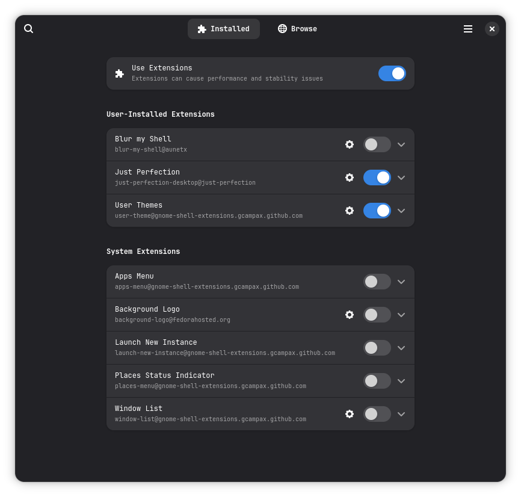

# Dotfiles

dotfiles repo

## Preview

**Full preview of Desktop**  
  
  

**Neovim**  
  
  

**VsCode**
  
  

  
  

## Info

**Disto: Fedora - Gnome**  
**Bar: Polybar**  
**Font: JetBrains Mono Nerd Font**  
**Colorscheme: [pywal16](https://github.com/eylles/pywal16)(Generating Colorscheme using the pywal16)**

## Extensions 

- **Just perfection** = to disable/hide panel and to make some changes in default gnome shell
- **User theme**= To change the theme

