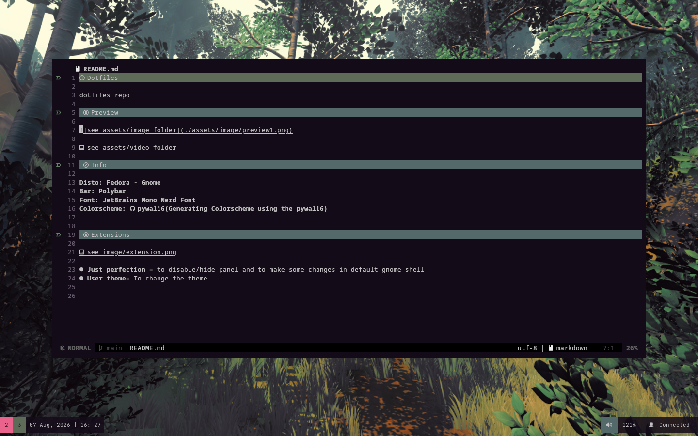
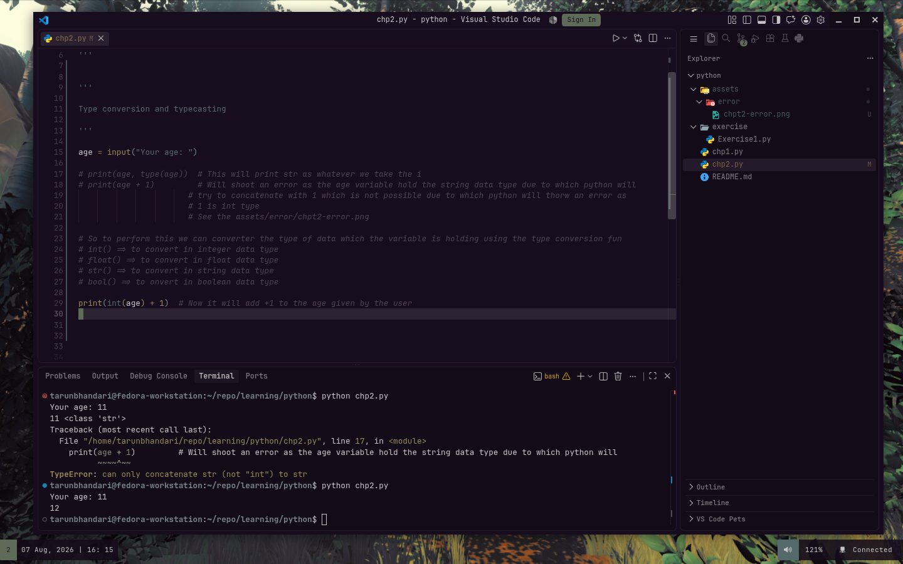
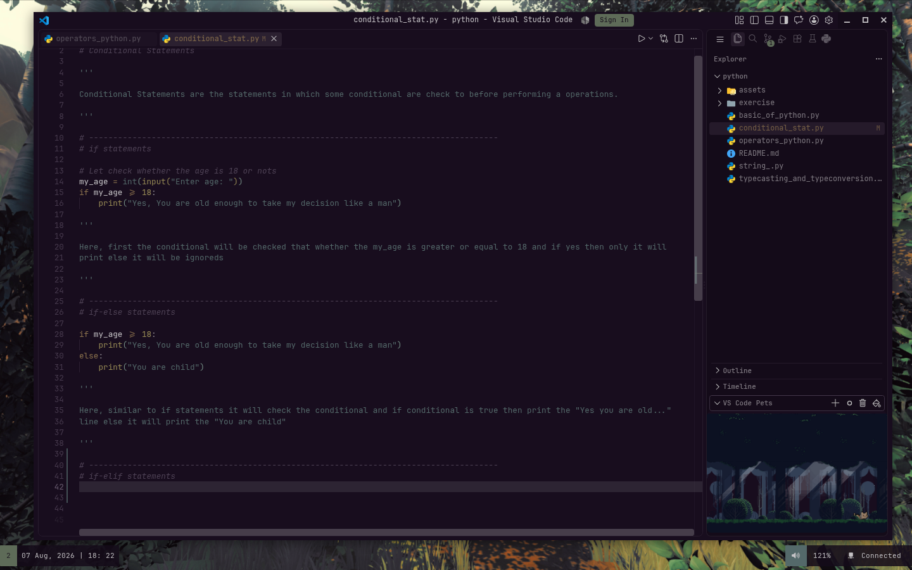

# Dotfiles

Welcome to my dotfile repo, which is a collection of the all the configuration files of an applications, WM, linux and some scripts.. 
  
Currently I am using the **Fedora** - A GNU linux based distro as my workstation with [pywal16](https://github.com/eylles/pywal16) (for generating the colorscheme from the wallpaper) and using the [polybar](https://github.com/polybar/polybar) for the bar/panel instead of the fedora default panel.

## Preview

**Full preview of Desktop**  
  
  

**Neovim**  
  
  

**VsCode**
  
  

  

  
  

## Info

**Disto: Fedora - Gnome**  
**Bar: [polybar](https://github.com/polybar/polybar)**
**Font: JetBrains Mono Nerd Font**  
**Colorscheme: [pywal16](https://github.com/eylles/pywal16)(Generating Colorscheme using the pywal16)**

## Extensions 

- **Just perfection** = to disable/hide panel and to make some changes in default gnome shell
- **User theme**= To change the theme

